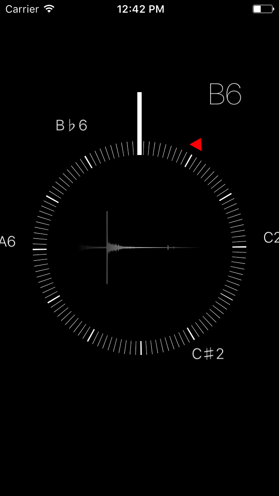

# Guitar Tuner for iOS

## Requirements

- [AudioKit](http://audiokit.io) 2.x
- ARC
- [CocoaPods](https://cocoapods.org)
- Swift 3.0

## Installing

Run the following commands:

    git clone https://github.com/theoc/guitar-tuner
    cd guitar-tuner

Then, make sure you have [CocoaPods](https://cocoapods.org) installed and run
the following two commands.

    pod install
    open Tuner.xcworkspace

## Original Author

Tim van Elsloo, [elsl.ooo](https://elsl.ooo)
Originally a result of a four-part series on Fourier transform at:
[elsl.ooo](https://elsl.ooo/2016/02/12/digital-tuner-ios-swift.html).

## License

Licensed under MIT license.
